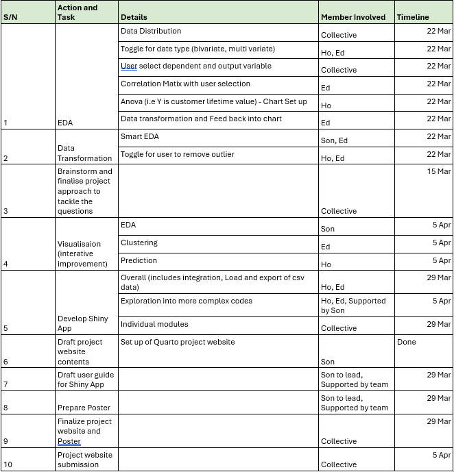
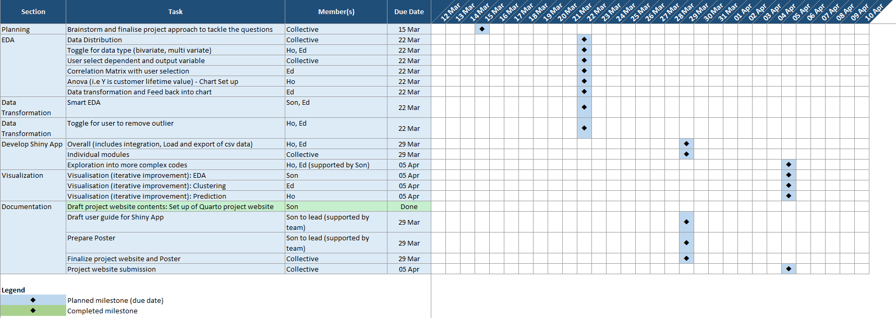
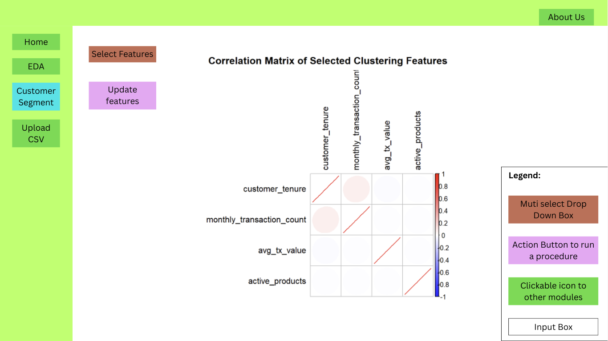
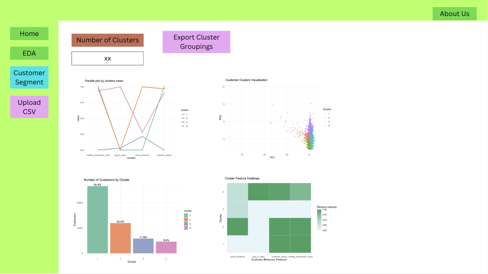
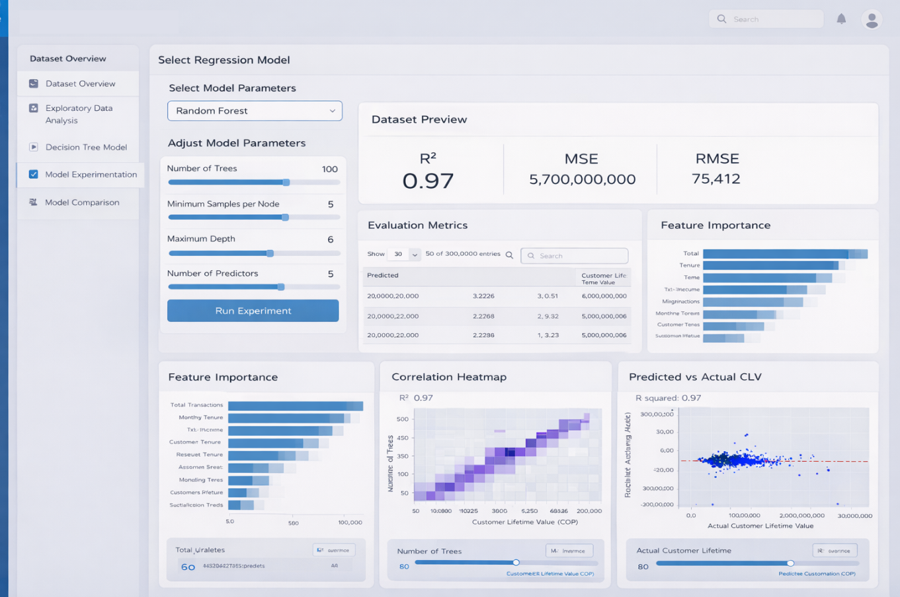

# Project Title: Fintech Customer Behavior and Risk Analytics

## 1. Introduction

Financial technology (fintech) has become a major driver of financial inclusion and digital transformation, particularly in emerging markets where digital platforms expand access to financial services. Despite the rapid growth of fintech ecosystem, real transactional behavior, product usage and customer engagement and financial activity remain limited. 

The Colombian Fintech Financial Analytics Dataset addresses this gap by providing a comprehensive dataset covering 48,723 Jan and Dec 2023. This dataset captures detailed customer financial behaviors including transaction activity, product usage, engagement levels and customer tenure within a fintech platform. 

By analyzing this dataset, valuable insights can be obtained regarding how customers interact with digital financial services, how their behavior evolves over time and which factors contribute most significantly to long-term customer value. 

This dashboard presents a data-driven analysis that combines Exploratory Data Analysis (EDA), customer segmentation (Clustering) and predictive modeling techniques to better understand fintech customer behavior and support strategic decision-making. 

## 2. Project Objectives

The primary objective of this project is to analyze customer financial behavior and predict long-term customer value using the dataset. Specifically, the project aims to identify key behavior and transactional factors that influence customer lifetime value, develop predictive models for future financial value generated by each customer and segment customers into meaningful behavioral groups to understand different engagement and product usage patterns. 

## 3. Motivation behind the Tasks

Understanding customer financial behavior is critical for fintech platforms aiming to maximize long-term profitability and improve customer experience. Traditional approaches often treat customers as a homogeneous group, overlooking the diverse behavioral patterns that influence customer value. By combining predictive modeling with custering analysis, this project provides a more comprehensive perspective on customer engagement.  

## 4. Problems that the team may face

This section highlights the potential challenges that the team might face. It also outlines the mitigation plans that will be implemented to reduce the risks associated with the current Shiny app project. 

|  |  |  |
|------------------------|------------------------|------------------------|
| **Potential Challenges**  | **Details**  | **Mitigation Plan**  |
| **Inconsistent data preparation**  | Different ways of data cleaning.  | To identify critical data preparation steps that require strict standardization.  |
| **Data size**  | The total file size amounts to \~130MB and the app might be computationally heavy to run.  | Precomputation of summaries to reduce on the need for backend calculation.  |
| **Consistency of modules**  | All the modules should be aligned in the business story they are trying to tell. They should have a natural flow.  | Need to firm up the agreed business question.  |
| **Over cluttering of charts**  | Multiple charts that repeats the same message  | To be highly selective on the charts to tell the story.  |
| **Potential empty plots due to too much filtering**  | Having too much filter resulting in blank plots  | To select only relevant features for slicing  |
| **Conflicting of Named variable**  | In the respective modules the team member might be using the same naming convention for the data view.  | To have a standardized naming convention (i.e. unique prefix to be add to avoid conflict).  |

## 5. Relevant Work and Proposed Approach

**Team Workflow:** The team will divide the work based on the three main modules of the application, with each member taking responsibility for one analytical component. 

**Data Preparation:** To ensure consistency across the project, the team will maintain a shared preprocessed base dataset with a common data structure, standardised variable definitions, and consistent coding conventions. This will support the smooth integration of all modules into a unified Shiny application. In addition, regular discussions and testing sessions will be conducted to ensure alignment across the EDA, clustering, and predictive modelling components. 

**Module Integration:** The team will also hold discussions to determine the most relevant visualizations and analytical outputs that can link the three modules in a coherent manner, thereby enhancing the usability and overall value of the Shiny application for end users. 

## 6. Scope of Work

The following table details the scope of work and responsibilities assigned to the respective members of the Team. The Team has also included a timeline to aid the Project’s internal progress monitoring.

{width="718"}

## 7. Prototype Ideation

Our prototype ideation started with low-fidelity sketches to outline the layout, navigation, and key functionalities of the Shiny application. The sketches were then refined into a higher-fidelity prototype that improves visual structure and usability.

**Ideation Sketches**

**High-fidelity Prototype**

**Key Features**

-   Side navigation tabs: allow user to select and move around the major modules of our app

-   Parameters selection: consist of variables lists or sliders to let user customize the parameters for plotting

-   Plotting area: show the plots and other components such as statistic metrics tab

## 8. Expected Outcomes

The expected outcome of the project is a functional and interactive R Shiny dashboard that enables users to configure models, run analyses, and interpret results within a single visual analytics environment. The final application is expected to support analytical storytelling and practical decision making by combining descriptive, unsupervised, and supervised analytics in one platform.
