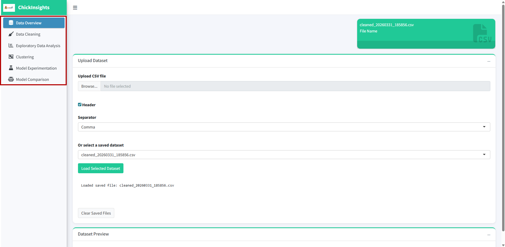
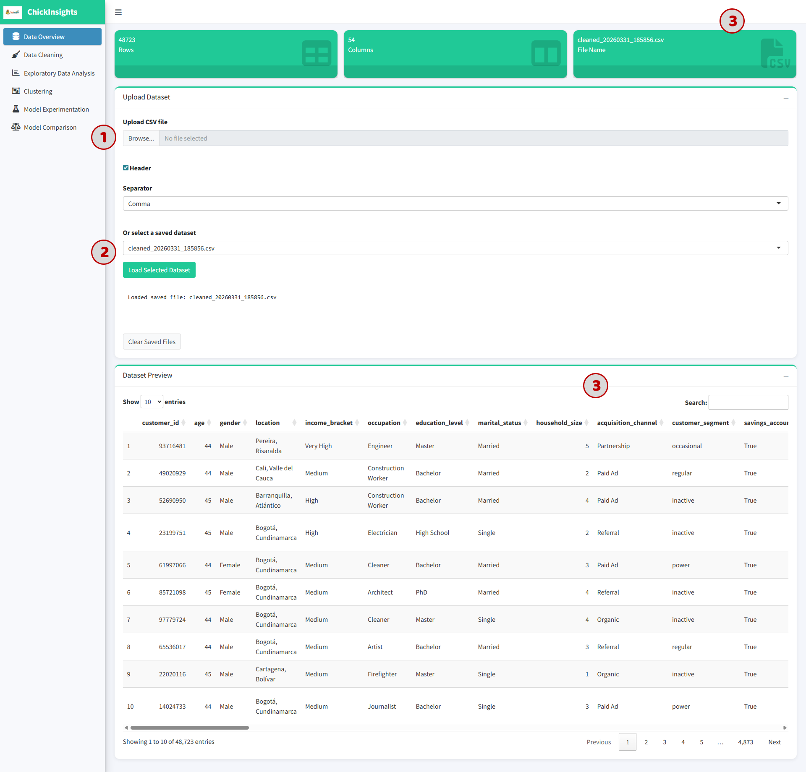
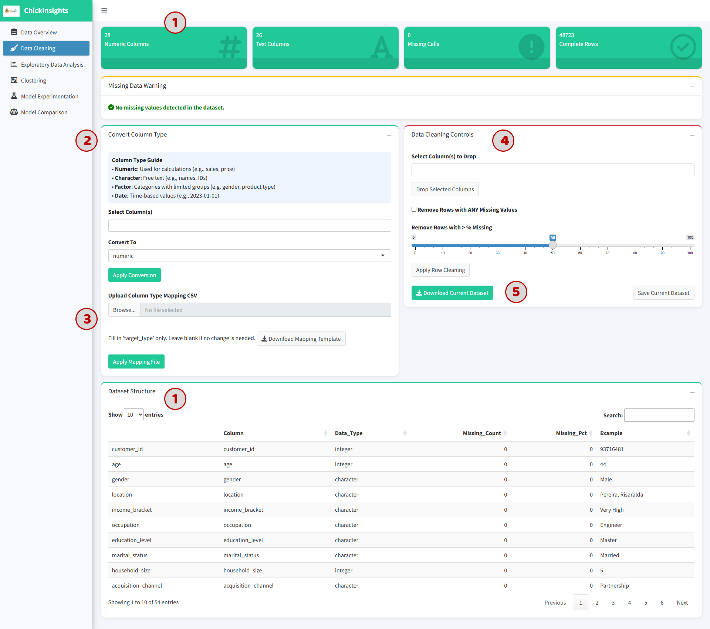
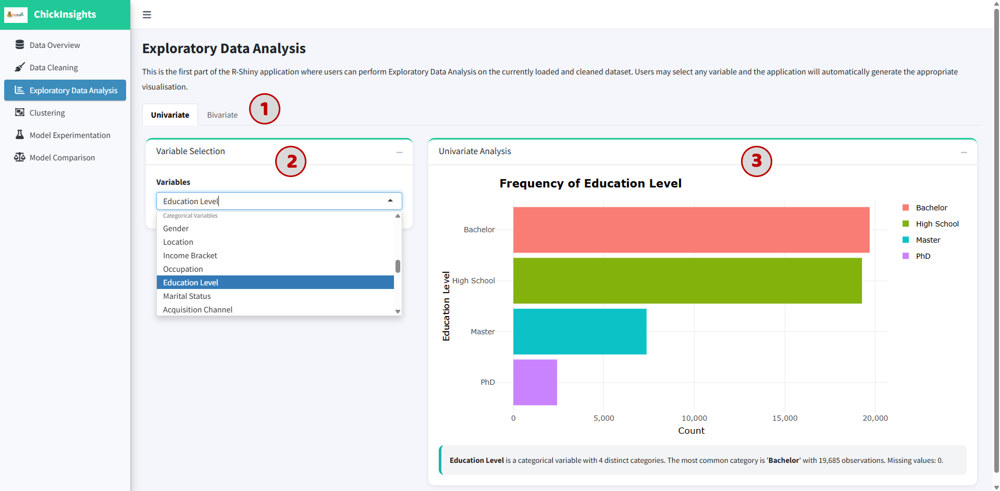
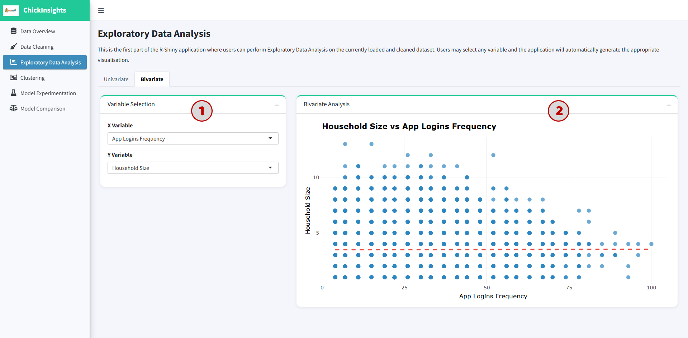
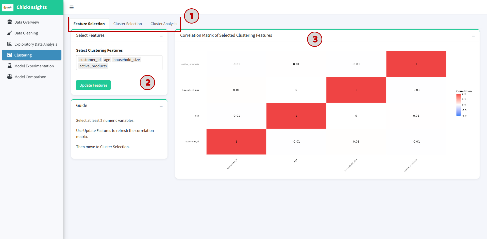
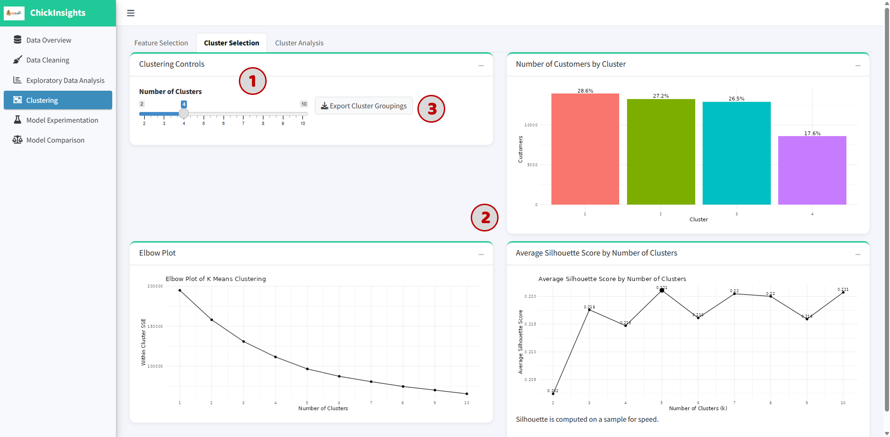
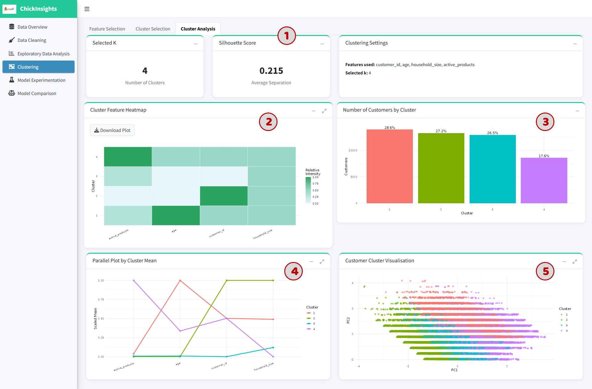
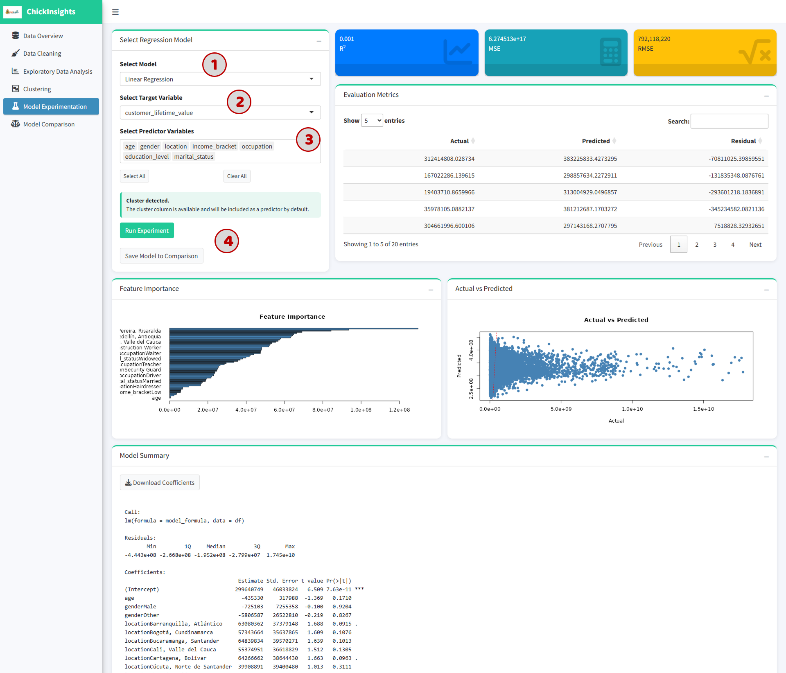
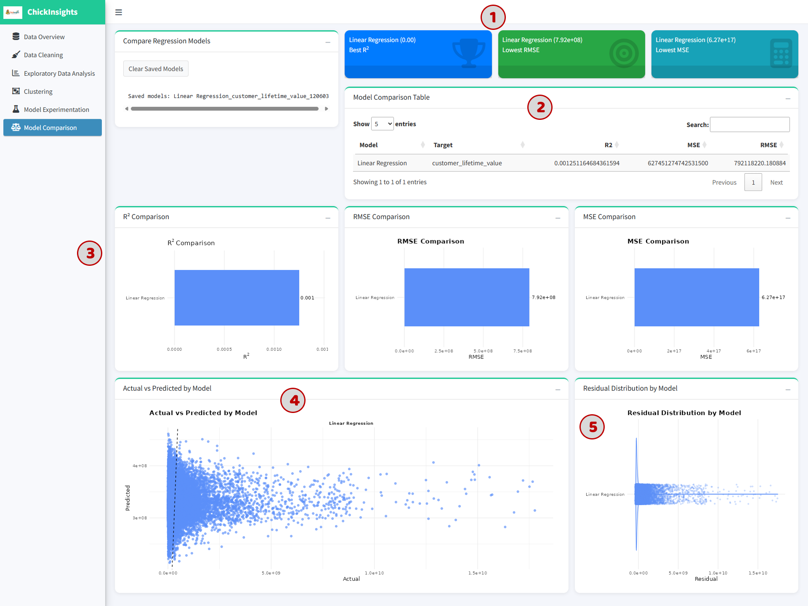

Our Shiny app is hosted on [shinyapps.io](https://edwardbyl.shinyapps.io/AChickenRiceStory/). This comprehensive guide will help you understand how to use the application.

## 1. Getting Started

-   On Launch: The landing page defaults to **Data Overview**.

-   Navigation: The sidebar contains the following modules:

    -   **Data Overview**

    -   **Data Cleaning**

    -   **Exploratory Data Analysis**

    -   **Clustering**

    -   **Model Experimentation**

    -   **Model Comparison**

## 2. Data Overview Module

Provides a summary of the dataset and allows users to upload or select datasets.

\(1\) Upload a dataset:

-   Click **“Browse”** under *Upload CSV file*

-   Ensure the file has headers and is comma-separated

\(2\) Alternatively:

-   Select a preloaded dataset from the dropdown

-   Click **“Load Selected Dataset”**

\(3\) Outputs

-   Dataset name

-   Total number of rows and columns

-   Preview table of the dataset (first 10 rows)

## 3. Data Cleaning Module

Allows users to preprocess and clean the dataset before analysis. This can be done by multiple selections or via a template upload.

\(1\) Dataset Summary Displays:

-   Number of numeric vs text columns

-   Missing values

-   Complete rows

-   Dataset Structure

\(2\) Convert Column Types:

1.  Select column(s)

2.  Choose target type:

    -   Numeric

    -   Character

    -   Factor

    -   Date

3.  Click **“Apply Conversion”**

::: callout-tip
Useful for variables like `age` → numeric or `income_bracket` → factor
:::

\(3\) Upload Mapping File

-   Upload a CSV to batch-convert column types

-   Users may download the template format provided

\(4\) Data Cleaning Controls

-   Drop selected columns

    or

-   Remove rows with missing values based on % threshold

\(5\) Save & Export Cleaned Data: Click **"Save Current Dataset"** to save changes or **"Download Current Dataset"** to download the new data.

## 4. Exploratory Data Analysis (EDA) Module

\(1\) User can select between Univariate and Bivariate tab

### 4.1 Univariate Analysis:

Analyze distribution of a single variable in isolation.

\(2\) Select a variable from dropdown box

\(3\) The system auto-generates plot base on the data type (such as bar chart for categorical or histogram for numeric)

::: {.callout-note title="Outputs"}
-   Chart visualization

-   Text summary (e.g., most frequent category)
:::

### 4.2 Bivariate Analysis

Explore relationships between two variables.

1.  Select X and Y variable

2.  The system generates plot base on the data types (such as scatter plot for numeric vs numeric; boxplot or grouped plots for categorical combinations)

::: {.callout-tip title="Interpretation Tip"}
-   Look for trends (positive/negative relationships)

-   Identify clusters or outliers
:::

## 5. Clustering Module

Enables users to segment customers into meaningful groups based on behavioral and demographic characteristics; supports identifying patterns such as high-value customers, low-engagement users, and distinct usage profiles.

\(1\) The module is structured into three main steps:

1.  **Feature Selection**

2.  **Cluster Selection**

3.  **Cluster Analysis**

### 5.1 Feature Selection

To select relevant numeric variables that will be used for clustering:

\(2\) Select at least **2 numeric variables** from the dropdown and click **“Update Features”**

\(3\) Output: A **Correlation Matrix Heatmap** is generated to show relationships between selected features

-   Values close to **+1 or -1** → strong correlation

-   Values near **0** → weak/no relationship

::: {.callout-important title="Best Practice"}
-   Avoid selecting highly correlated variables (to reduce redundancy)

-   Focus on behavior-related variables for better clustering results
:::

### 5.2 Cluster Selection

To determine the optimal number of clusters (K).

*This will automatically update underlying active data to be used for further analysis.*

\(1\) Use the **slider** to select number of clusters (K = 2 to 10)

\(2\) Observe the following visual aids:

-   Elbow Plot: Shows Within-Cluster Sum of Squares (WCSS). Look for the “elbow point” where improvement slows down -\> indicates a good number of clusters

-   Silhouette Score Plot: measures how well data points fit within their cluster, range from -1 to +1. Closer to **1** → better clustering; around **0.2–0.5** → moderate separation. (Cluster with highest silhouette score will have a larger point)

-   Cluster Distribution Chart: Displays number (and %) of customers in each cluster

::: {.callout-tip titile="Decision Tip"}
Choose K where:

-   Elbow stabilizes

-   Silhouette score is relatively high

-   Clusters are reasonably balanced
:::

\(3\) Click **“Export Cluster Groupings”** to download results

### 5.3 Cluster Analysis

To interpret and understand the characteristics of each cluster.

\(1\) Summary Metrics

-   Selected number of clusters (K)

-   Average silhouette score

-   Cluster settings (feature used, selected k)

\(2\) Cluster Feature Heatmap: Shows relative values of features per cluster. Darker color → higher relative value

\(3\) Cluster Size Distribution: Bar chart showing proportion of customers in each cluster

\(4\) Parallel Coordinate Plot: Displays cluster means across all selected features, each line = one cluster. Helps compare patterns across variables

\(5\) Customer Cluster Visualization (PCA Plot): 2D projection of customers using PCA

-   Each dot = one customer

-   Colors = cluster membership

-   Separation indicates clustering quality

## 6. Prediction Modelling Module - Model Experimentation & Comparison

### 6.1 Model Experimentation

Allows users to build predictive models to estimate key business outcomes (such as CLV). Users can select different variables and evaluate model performance through multiple metrics and visual diagnostics.

\(1\) Select Model Type: Choose a regression model (e.g., **Linear Regression, randomForest, XGBoost**) from the dropdown

\(2\) Select Target Variable to predict

\(3\) Select Predictor Variables: select relevant input features such as Demographics (`age`, `gender)`, Socioeconomic (`income_bracket`, `occupation)`, Behavioral: (`app_logins_frequency`, `active_products`)

*(\*) If clustering has been performed: Cluster labels are automatically included as predictors.*

\(4\) Click **“Run Experiment”**. *(\* Optional)* Click **“Save Model to Comparison”** for later evaluation.

::: {.callout-note title="Outputs & Interpretation"}
-   Performance Metrics: Displayed at the top:

    -   **R² (Coefficient of Determination)**: measures how well the model explains variance, range from 0 to 1. Higher = better fit.

    -   **MSE (Mean Squared Error)**: measures average squared prediction error (lower = better)

    -   **RMSE (Root Mean Squared Error)**: same as MSE but in original scale

-   Evaluation Table: actual values, predicted values, residuals (errors). This table is meant to identify large prediction errors or detect model instability.

-   Feature Importance Plot: shows relative importance of predictors. Longer bars = stronger influence on prediction

-   Actual vs Predicted Plot: Scatter plot comparing (X-axis: Actual values) and (Y-axis: Predicted values). Ideal model → points along diagonal line.

-   Model Summary: regression coefficients, p-values, residual distribution.
:::

::: {.callout-tip title="Best Practices"}
-   Avoid including irrelevant variables

-   Use domain knowledge for feature selection

-   Check multicollinearity before modeling

-   Compare multiple models before concluding
:::

### 6.2 Model Comparison Module

Allows users to evaluate and compare multiple saved models to determine the best-performing one.

::: callout-important
Ensure at least one model is saved.
:::

::: {.callout-note title="Outputs & Interpretation"}
-   \(1\) The top cards display "Best Model Highlights" (best R², lowest RMSE, lowest MSE), helps quickly identify the best-performing model.

-   \(2\) Model Comparison Table consists of Model name, Target variables, R², MSE, RMSE.

-   \(3\) Metric Comparison Charts includes R², RMSE, MSE comparison.

-   \(4\) Actual vs Predicted Plot: shows prediction performance across models, helps visually assess model accuracy or spread of predictions.

-   \(5\) Residual Distribution Plot shows error distribution: Centered around 0 → good model; Wide spread → poor accuracy; Skewed → biased predictions.
:::

::: callout-tip
Choose the best model based on:

-   Highest **R²**

-   Lowest **RMSE**

-   Balanced residual distribution

-   Consistent prediction patterns
:::
